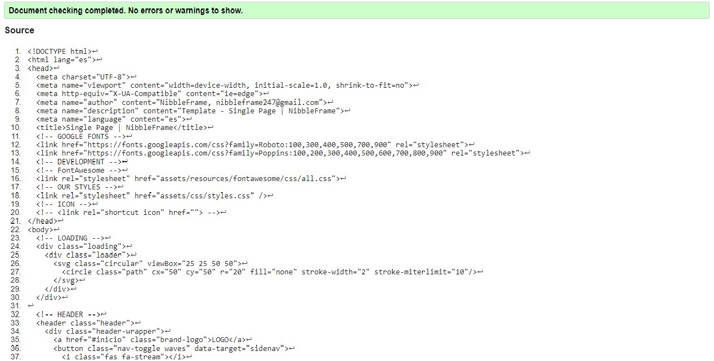

# Templates for our Projects | NibbleFrame
En este branch se crearan y gestionaran todos los templates de paginas web para nuestros proyectos.

## Buenas Practicas Front End
Cuando alguien lea nuestro código que paresca que una sola persona lo escribio

### Practicas HTML
1. Jerarquia de h1-h6

### Practicas CSS
1. Escribe CSS reutilizable DRY (Don't Repeat Yourself)
2. Nomeclatura de clases Kebab Case ejemplo-de-nomenclatura
3. Formula PC-TV en el ordenamiento de los atributos CSS 
    * Posicionamiento: position, z-index, display, float 
    * Caja (Modelo de Caja): width, height, padding, border, margin
    * Texto: font-\*, text-\*
    * Variado: background,  opacity, transition, ...
4. Enfoques 
    * Mobile First - Progressive Enhancement
    
    ```css
    .content {

      @media (min-width: 800px) {
        float: left;
        width: 60%;
      }
    }
    ```

    * Desktop First - Graceful Degration

    ```css
    .content {
      float: left;
      width: 60%;

      @media (max-width: 800px) {
        float: none;
        width: 100%;
      }
    }
    ```

5. Aplicar Responsibe Design a nuestro Responsive Design
    * Responsive Design: Buenas practicas con css
        *  Uso de media queries
        * Todo los elementos que no sean textos tienen que ser flexibles(imagenes, videos, layout, etc)
        * Grid Flexible
    * Responsible Responsive Design: Buenas prácticas de CSS + JS
6. BEM MOD
  * Nomenclatura BEM modificada solo ( - ) guiones block-element | block-modify block-element-modify 
7. Evitar el uso de ñ s

### Practicas JS
1. Nomeclatura Variables CamelCase Case / var ejemploDeNomenclatura
2. Nomenclatura Constantes del DOM Iniciar con $ y CamelCase / const $ejemploDeNomenclatura
3. Clases(POO) Primera letra con Mayuscula
4. Uso de let en for / foreach

### Validacion HTML


### Semantic HTML5
