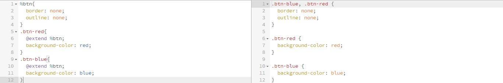
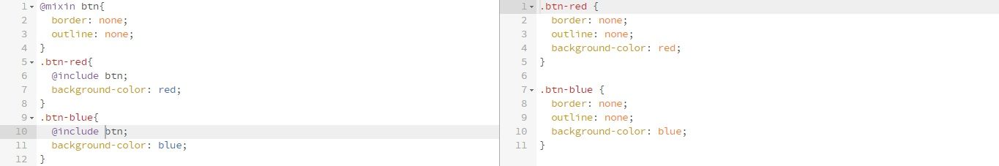

# Template Single Page | NibbleFrame
Caracteristicas
* scrollspy
* responsive
* sidenav silde down
* Messages Services

## Arquitectura Sass
Organización de carpetas y archivos Sass.

### Vendor
Librerias externas

### Priority
* loading

### Lib
Herramientas y helpers de Sass
* base colors
* variables
* mixins-media
* functions
* placeholders
* mixins

### Global
Estilos y clases globales
* reset
* generals
* class

### Layout
Estilos de los layouts
* header
* navigation
* inicio
* nosotros
* servicios
* contactanos
* footer

### Components
Herramientas y helpers de css
* media
* animations

## Organizacipon JS
Forma de organizar archivos JS
* variables
* windowDocuemnt
* events
* functions
* mediaQueries

## Placeholders vs Mixins
* Placeholder

* Mixin
