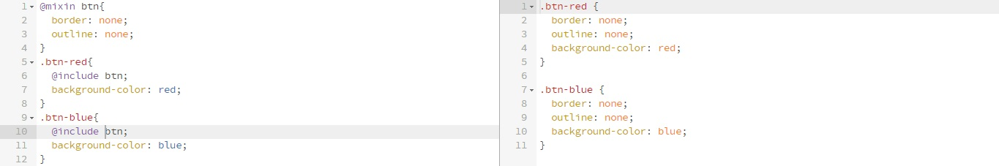

# Template Single Page | NibbleFrame
Caracteristicas
* scrollspy
* responsive

## Arquitectura Sass
Organización de carpetas y archivos Sass.

### Vendor
Librerias externas

### Lib
Herramientas y helpers de Sass
* base colors
* variables
* mixins
* functions
* placeholders

### Global
Estilos y clases globales
* reset
* generals
* class

### Layout
Estilos de los layouts
* header
* navigation
* sections
* inicio
* nosotros
* servicios
* contactanos
* footer

### Components
Herramientas y helpers de css
* media
* animations

## Debates
* Media Querys
* Fontsize Responsive
* Reset fontsize
* Material Design
* Tamaño de imagenes

## Placeholders vs Mixins
* Placeholder

* Mixin
